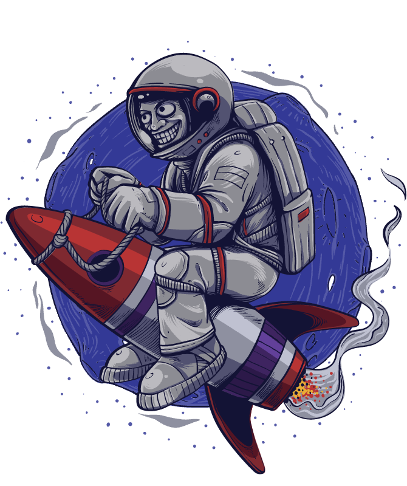

<div align="center">
  
    <h1>3D Portfolio</h1>
</div>

This project is a 3D portfolio built using ReactJS. It showcases different sections with interactive 3D models, animations, and a contact form.

## Sections

### 1. Hero
- The Hero section features a floating image with a distorting sphere in the background, creating an engaging and dynamic visual.

### 2. Who
- The Who section presents a 3D cube on the left side, which auto-rotates and displays an animated "Hello" text.
- On the right side, there is descriptive text about who you are.

### 3. Works
- The Works section lists the following categories on the left side:
  1. Web Design
  2. Development
  3. Illustration
  4. Product Design
  5. Social Media
- Each category is accompanied by a respective 3D model on the right side, along with a description box providing more details.

### 4. Contact
- The Contact section includes a map on the right side and a contact form on the left. The form allows users to submit their name, email, and message.

## Functionalities

### 3D Models

- The 3D models used in this project are sourced from [Sketchfab](https://sketchfab.com/) and downloaded in the `.gltf` format.
- To optimize and convert these models for use in the project:
  1. Install the necessary tools globally:
     ```bash
     npm install -g gltf-pipeline
     ```
  2. Navigate to your model's folder and run:
     ```bash
     gltf-pipeline -i model.gltf -o modelDraco.gltf -d
     ```
     Replace `model` with your model's name.
  3. Convert the model to a JSX component using:
     ```bash
     npx gltfjsx model.gltf --transform
     ```
     Again, replace `model` with your model's name. This will generate a `.jsx` file and a transformed model file. Import these into your project folder.

### Cube Animation (Who Section)

- The cube in the Who section is created using `three`, `@react-three/fiber`, and `@react-three/drei`.
- Install the required packages:
  ```bash
  npm install three @react-three/fiber @react-three/drei
- For more information, visit the [React Three Fiber documentation]([https://sketchfab.com/](https://docs.pmnd.rs/react-three-fiber/getting-started/introduction))

### Contact Form

- The contact form is powered by [EmailJS](https://www.emailjs.com/), allowing the form submissions to be sent directly to your email.
- Learn more by following this [EmailJS contact form tutorial](https://www.emailjs.com/docs/tutorial/creating-contact-form/).
- To set up your own API, visit [EmailJS](https://www.emailjs.com/).
- To display the map, install the necessary package:
  ```bash
  npm i -S react-simple-maps
  ```
- For more details about using annotations on the map, check out the [React Simple Maps documentation]([https://www.emailjs.com/](https://www.react-simple-maps.io/docs/annotation/)).

## Installation

1. Clone the repository:
   ```bash
   git clone https://github.com/ByakkoHvsc/3D_Portfolio.git
   ```

2. Navigate to the project directory:
   ```bash
   cd 3D_Portfolio
   ```

3. Install the dependencies:
   ```bash
   npm install
   ```

4. Start the development server:
   ```bash
   npm start
   ```

## Contributing

Feel free to open issues or submit pull requests for any improvements or bug fixes.

## Disclaimer

This project is a recreation of an existing project for educational purposes. All credits go to the original creators.
